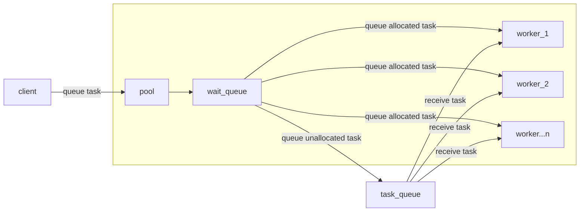
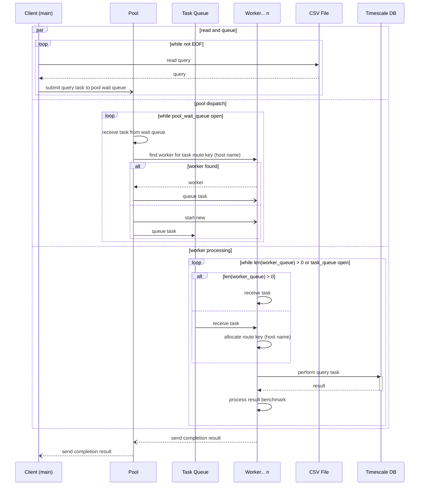

# ⚡ Timescale Benchmark

A command line tool to benchmark `SELECT` query performance across multiple workers against a TimescaleDB instance.

**Implementation details:**

- Workers are only started when an available query task with an unallocated host name is received, which ensures that
  workers are not unnecessarily spun up. This is to avoid a scenario where 100 workers are started but every query has
  the same host name, resulting in 99/100 workers not being utilised.
- Routing of query tasks are completely based on host names. A query task will be sent to a worker only if the host name
  is already allocated to it, otherwise the query is added to a task queue for new/available workers to pick up. This
  results in an even distribution and makes it impossible to experience 'hot' workers.

**Basic benchmarks**

Benchmarks were run for 5000 mock queries hard coded to each take 200ms, where each query has a unique host name. Unique
host names were used to ensure maximum allowed workers could be utilised. It is clearly evident that adding more workers
improves overall runtime performance. However, it is also apparent that once a certain threshold is reached, more
workers don't necessarily result in better performance. This is noticeable in benchmarks where workers started are
greater than 500.

| Workers started | Runtime | Query processing time |
|-----------------|---------|-----------------------|
| 10              | 1m 42s  | 16m 50s               |
| 50              | 20.39s  | 16m 44s               |
| 100             | 10.27s  | 16m 42s               |
| 500             | 2.74s   | 16m 41s               |
| 1000            | 4.69s   | 16m 42s               |
| 5000            | 12.36s  | 16m 43s               |

## 🚀 Running

Before proceeding, please ensure you have Docker installed and running.

1. Start TimescaleDB and wait ~10s post startup to ensure test data is all loaded and the database is ready to accept
   connections.

   ```shell
   docker-compose -p tsbenchmark up -d
   ```

2. Build the `tsbenchmark` image.

   ```shell
   docker build -t local/tsbenchmark .
   ```

3. Run the `tsbenchmark` container. Note that in the command below the container runs on same network as the database
   and that a volume is mounted to give the container access to `query_params.csv`. You can also use the `-h` flag to
   display usage and a list of all available flags.

   ```shell
   docker run --rm --name tsbenchmark \
   --network tsbenchmark_default \
   --volume $(pwd)/database/query_params.csv:/data/query_params.csv \
   local/tsbenchmark  \
   --max-workers 5 /data/query_params.csv # flags and filepath here
   ```
4. Stop TimescaleDB.
   ```
   docker-compose -p tsbenchmark down
   ```

## 🔬 Testing

Unit tests

```shell
go test -count=1 ./...
```

Smoke test (requires TimescaleDB to be running)

```shell
go test --tags=smoke -count=1 ./cmd...
```

## 🧰 Tools Used

- Go 1.18.1
- Docker 20.10.10 CE

## 🔍 Design

#### High level flow chart



#### Low level sequence diagram

