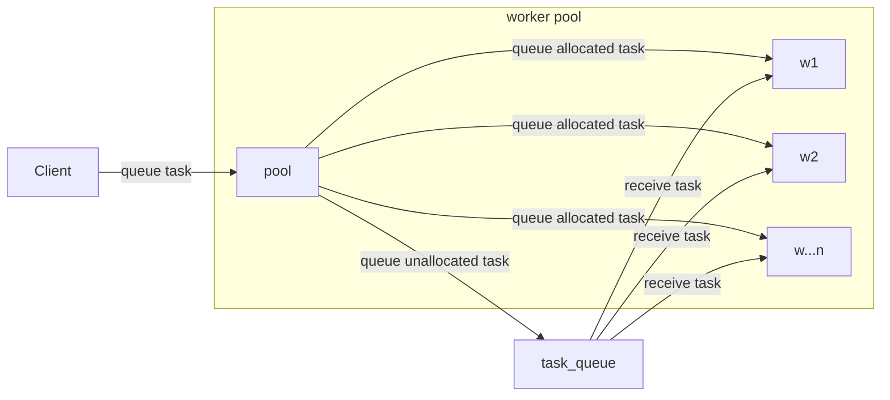

# ⚡ Timescale Benchmark

Implement a command line tool that can be used to benchmark `SELECT` query performance across multiple workers/clients
against a TimescaleDB instance. The tool should take as its input a CSV file (whose format is specified below) and a
flag to specify the number of concurrent workers. After processing all the queries specified by the parameters in the
CSV file, the tool should output a summary with the following stats:

- Number of queries processed
- Total processing time across all queries
- Minimum query time (for a single query)
- Median query time
- Average query time
- Maximum query time

## 🧰 Prerequisites

- Go 1.18.1
- Docker 20.10.10 CE

## 🚀 Running

1. Start and migrate TimescaleDB:
   ```
   docker-compose -p timescaledb up -d --build
   ```
2. Build tsbenchmark image:
   ```
   docker build -t local/tsbenchmark .
   ```
3. Run tsbenchmark:
   > ℹ️ Use `-h` flag to output help for all available options.
   ```
   docker run --rm --name tsbenchmark local/tsbenchmark filename.csv -m 10
   ```
4. Stop TimescaleDB
   ```
   docker-compose -p timescaledb down
   ```

## 🔬 Testing

- Unit tests: `make unit`

## 🔍 Design

#### High level flow chart



#### Low level sequence diagram

